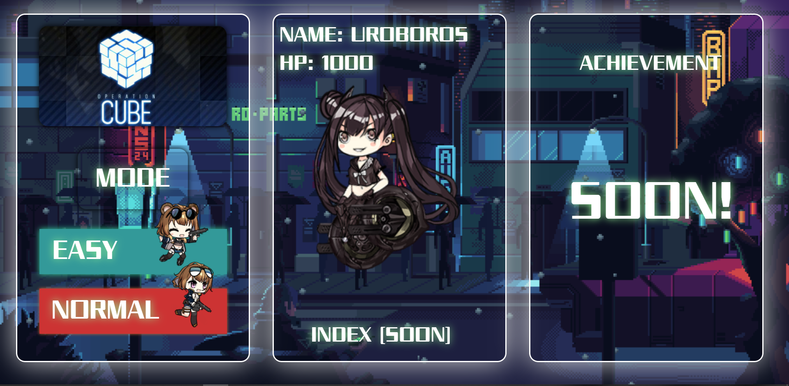
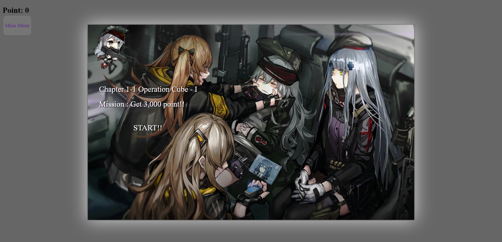
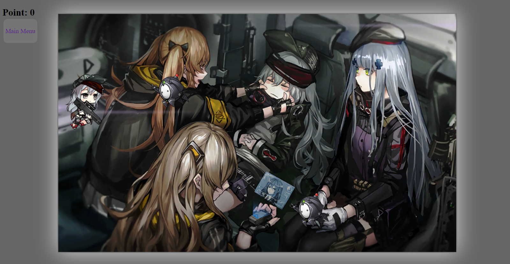

 ## Game : Cube 

Cube เป็น [Arcade game](https://en.wikipedia.org/wiki/Arcade_game) 
- เเนว  [Shoot 'em up](https://en.wikipedia.org/wiki/Shoot_%27em_up) 
- ได้รับเเรงบันดาลใจมาจากเกม [Space Invaders](https://en.wikipedia.org/wiki/Space_Invaders) 
- ตัวละครทั้งหมดมาจาก เกม [Girl's frontline](https://www.gfwiki.com/wiki/Girls%27_Frontline_Wiki)

## How to play 

  

  

  

1. บังคับด้วยการ กดแป้นลูกศรขึ้น, ลง(Arrow up & down)  เเละ ยิงด้วยการกด สเปทบาร์(Space bar)
2. จะได้รับเเต้ม 100 เเต้ม ทุกๆมอนสเตอร์ 1 ตัวที่กำจัดได้
3. จะผ่านด่านเมื่อเเต้มถึงค่าที่กำหนด เเละจะเข้าสู่ด่านบอส ให้ยิง มอนสเตอร์ เเละ บอส จนกว่าจะผ่านด่าน
4. หาก มีมอนสเตอร์ หรือ บอส ผ่านมาถึงฝั่งเดียวกับผู้เล่นเกมจะจบทันที

## Player and Monsters

 
  
   

## Reference
- [Girl's frontline](https://www.gfwiki.com/wiki/Girls%27_Frontline_Wiki)

## Team Members : 7982

|||||
|:-:|--|---------------|---------|
||นายธนา สามารถ|[ThanaIT079](https://github.com/ThanaIT079)|61070079|
||นายธเนศวร พิมพ์พา|[Thanesuan07](https://github.com/thanesuan07)|61070082|

